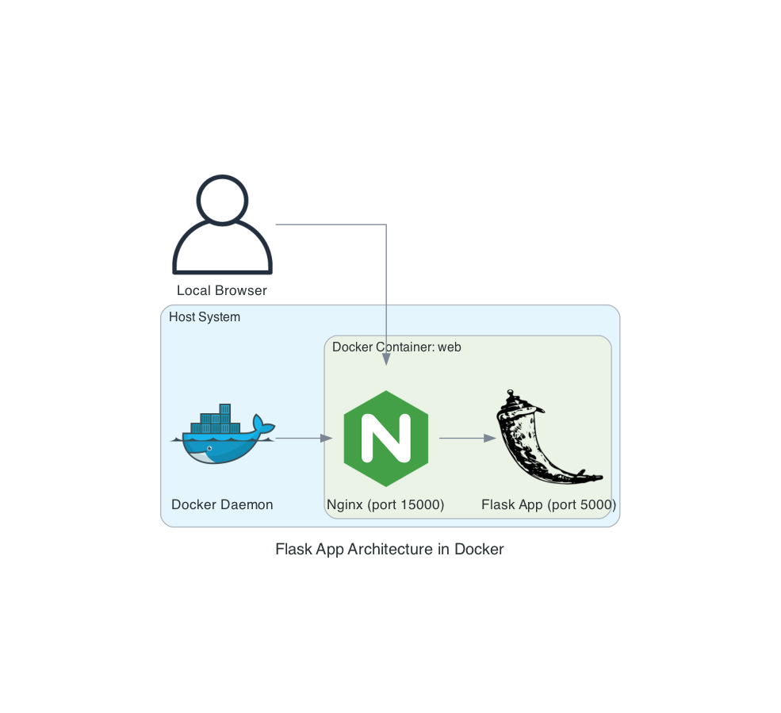

# Summary Report

## 1. Steps Taken
The first thing I did with this assignment was get the environment working and explore the web application. I reviewed the code and then tested the endpoints a few different ways to confirm vulnerable behavior. Next, I ran the check, scan, and host-security commands to see what additional vulnerabilities I missed.

To start hardening, I copied the before folder into a new folder called after. Then I began refactoring the ping and calculate endpoints, and changing the binding to 127.0.0.1. After discovering the Flask app was no longer reachable outside of the container, and confirming this was appropriate behavior, I added nginx and exposed port 15000 to demo the hardened application.

Once the application was hardened, I moved on to hardening the container itself. I started by updating the container to python:3.12-alpine, and tested the app. Everything worked fine, so I repeated this process with python:3.13-alpine and found similar results. I decided to go with the newer container. Next, I confirmed the vulnerabilities were remediated with check and scan.

My final hardening actions were to review the logs from host-security and fix a few of them. I started this process by writing the hardening script required for the assignment to modify the Docker daemon, Dockerfile, and docker-compose.yaml. I found an article on container security to determine what changes I should make to the Docker daemon (Walker, 2023). For the Dockerfile and docker-compose.yml, I added the required hardening controls in the assignment instructions.

## 2. Vulnerabilities Found and Fixed
### 2.1 Vulnerabilities from Bandit Analysis
| Vulnerability | Location | Fix Actions | Rationale |
|---------------|----------|-------------|-----------|
| [CWE-78: Improper Neutralization of Special Elements used in an OS Command](https://cwe.mitre.org/data/definitions/78.html) | ping subprocess | Refactored ping endpoint to use socket | Allows connectivity tests without OS-level command execution |
| [CWE-259: Use of Hard-coded Password](https://cwe.mitre.org/data/definitions/259.html) | app.py | Removed hardcoded password | Password was not used |
| [CWE-78: Improper Neutralization of Special Elements used in an OS Command](https://cwe.mitre.org/data/definitions/78.html) | /ping endpoint | refactored ping endpoint to use socket | Allows connectivity tests without OS-level command execution |
| [CWE-78: Improper Neutralization of Special Elements used in an OS Command](https://cwe.mitre.org/data/definitions/78.html) | /calculate endpoint | refactored calculate endpoint to use ast.literal_eval() | Eliminates the risk of arbitrary code execution |
| [CWE-605: Multiple Binds to the Same Port](https://cwe.mitre.org/data/definitions/605.html) | flask app.py | refactored app.py to bind to 127.0.0.1 | Restricts access to the flask app to internal container components |

### 2.2 Vulnerabiltiies from Scout Analysis
| Vulnerability | Location | Fix Actions | Rationale |
|---------------|----------|-------------|-----------|
| Python:3.9-alpine contains multiple vulnerabilities | Base Container | Updated base container to Python:3.13-alpine | Newest base container does not cause any application conflicts and resolves all known vulnerabilities from Python:3.9-alpine |

### 2.3 Vulnerabilities from Docker Bench for Security
| Vulnerability | Location | Fix Actions | Rationale |
|---------------|----------|-------------|-----------|
| No Healthcheck found | mywebapp:latest | Added HEALTHCHECK to Dockerfile | Ensure HEALTHCHECK instructions have been added to the container image to check for availability and restart containers as needed |
| No SecurityOptions Found | before-web-1 | Set no-new-privileges:true | Prevents privilege escalation attacks |
| Running as root | before-db-1 | Deleted db container | Eliminated extra services since the database was not being used |
| Container running without memory restrictions | before-web-1 | Set mem_limit: 256m | Prevents starvation due to consuming too much memory |
| Container running without CPU restrictions | before-web-1 | Set cpus: 0.5 | Prevents fork bombs that consume too many resources |
| Container running with root FS mounted R/W | before-web-1 | Set read_only: true | Prevents tampering with system files or writing malicious code |
| Port being bound to wildcard IP | before-web-1 | bind to 127.0.0.1 | Restricts access to the localhost only |
| Privileges not restricted | before-web-1 | Set security_opt: no-new-privileges:true | Blocks privilege escalation |
| Health check not set | before-web-1 | Add HEALTHCHECK to Dockerfile | Enables automated detection and recovery |
| PIDs limit not set | before-web-1 | pids_limit: 100 | Prevents starvation due to creating too many processes |

## 3. How Architecture Improves Security

This architecture improves security in several ways. First, the elimination of extraneous services reduces the attack surface. The web application did not use the database container, and it was built with hardcoded passwords in the Dockerfile and app.py. Removing this container allowed the removal of these hardcoded credentials. Alternatively, I could have replaced the hardcoded credentials with a .env file, but this was unnecessary since I decided to remove it. 

Refactoring app.py to use ast.literal() and sockets eliminates code-level vulnerabilities that allow arbitrary code execution. I also enforced the principle of least privilege in the Dockerfile by using appuser, setting the security options, and mounting the filesystem as read-only. Limiting resource consumption for memory, CPU, and pids reduces the risk of resource starvation or fork bomb attacks.

Binding the flask app to 127.0.0.1 limits network exposure. This architecture makes the app inaccessible from outside the container, so to demonstrate the hardened web application securely, I installed nginx and exposed it on port 15000. Nginx listens for web traffic and passes it to the Flask app on 127.0.0.1:5000.

Adding HEALTHCHECK instructions to the Dockerfile allows automatic monitoring and restarting of unresponsive or failed containers. This addition improves the availability and resilience of the application. 

## 4. Reflection on Lessons Learned
I learned quite a bit through this assignment. I have led projects where we implemented container architecture, but I have not been the person with hands-on keyboard. I am familiar with the concepts, but this assignment allowed me to see how those concepts are implemented and some of the challenges along the way. 

I found that my hardening actions broke things at several points throughout the assignment. These issues are to be expected, and troubleshooting them gave me a deeper understanding of how these services work under the hood. There were also times when I had to step back and think about the correct action to secure the architecture. One example is the decision to remove the database container. I could have hardened it, but it was not doing anything, and I felt it was better to reduce the attack surface. This decision also made it unnecessary to include the .env file, since the database credentials were the only thing using it.

Recording the video was also a good experience because it forced me to think about things progressively. Explaining the application vulnerabilities and my rationale for the hardening steps I implemented reinforced the lessons. I feel like I have a much deeper understanding of container security than I did before starting this assignment.

## References
Walker, J. (2023, July 28). *21 Docker security best practices: Daemon, Image, containers.* Spacelift. https://spacelift.io/blog/docker-security